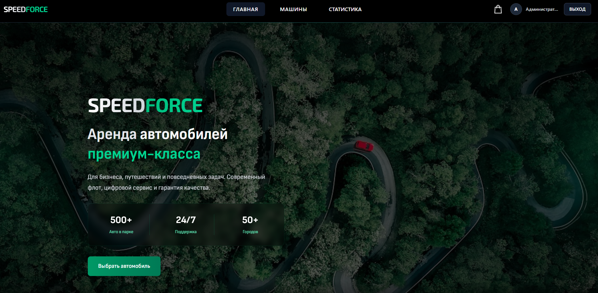
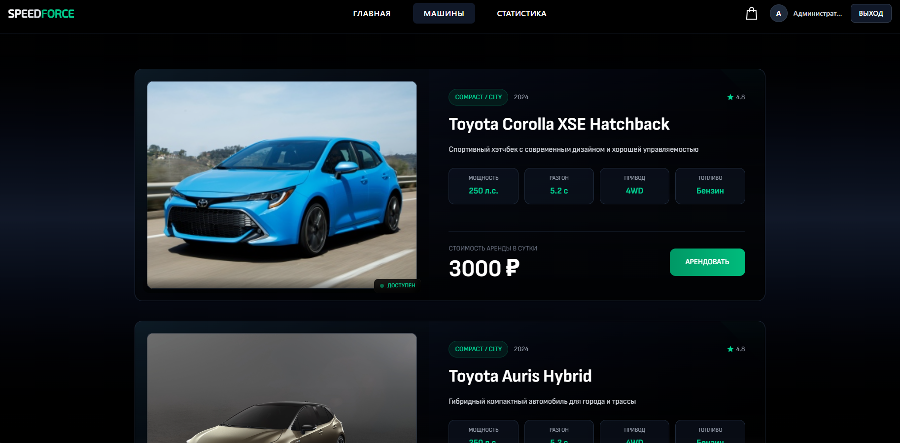
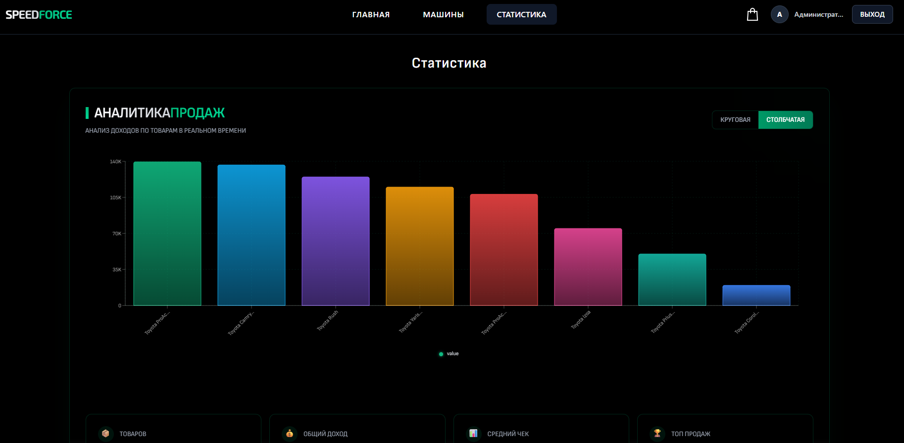

# SPEEDFORCE 🚗  
Веб-приложение для аренды автомобилей

## О проекте

**SPEEDFORCE** — это полнофункциональное веб-приложение для посуточной аренды автомобилей, разработанное в рамках учебной практики на 3 курсе колледжа по заказу.

Проект реализует взаимодействие фронтенда и бэкенда, работу с базой данных, систему авторизации пользователей и оформление заказов.  
Основной акцент сделан на создании удобного пользовательского интерфейса и функциональной серверной части.

## Демо




---

## Задача проекта

- разработать клиент-серверное веб-приложение  
- реализовать взаимодействие frontend ↔ backend  
- создать систему регистрации и авторизации  
- реализовать каталог товаров (автомобилей)  
- разработать корзину и оформление заказов  
- добавить административную панель со статистикой  
- наполнить базу данных тестовыми данными  

---

## Функционал

- каталог автомобилей с категориями  
- просмотр карточек автомобилей  
- добавление товаров в корзину  
- оформление заказа  
- регистрация и авторизация пользователей  
- личный кабинет  
- админ-панель  
- статистика и графики продаж  
- адаптивный интерфейс  

## Технологии

**Frontend**
- React  
- Vite  
- Tailwind CSS  

**Backend**
- Node.js  
- Express  

**Database**
- SQLite3  

---

## Роль в проекте

Выполненные задачи:

- разработка frontend части (React)  
- разработка backend API (Node.js + Express)  
- проектирование и подключение базы данных SQLite3  
- реализация системы авторизации и регистрации  
- разработка логики корзины и заказов  
- создание административной панели  
- реализация статистики и графиков  
- интеграция frontend и backend  

---

## Что решает проект

**Проект демонстрирует:**

- построение полноценного fullstack-приложения  
- взаимодействие клиентской и серверной частей  
- реализацию бизнес-логики (заказы, пользователи)  
- работу с базой данных  

---

## Практикуемые навыки

- React (компонентный подход)  
- работа с REST API  
- Node.js и Express  
- проектирование базы данных  
- работа с SQLite3  
- управление состоянием приложения  
- построение архитектуры fullstack-приложения  

---

## Структура проекта

```
SPEEDFORCE/
├── backend-db/
│ ├── database.db
│ ├── server.js
│ ├── database.js
│ └── seedSales.js
│
├── front/
│ ├── public/
│ ├── src/
│ │ ├── components/
│ │ │ └── ui/
│ │ ├── pages/
│ │ ├── stores/
│ │ ├── App.jsx
│ │ └── routes.js
│ ├── index.html
│ └── package.json
│
├── README.md
```

---

## Запуск проекта

**1. Клонирование репозитория**
```
git clone https://github.com/Kirikiri2/SPEEDFORCE-react.git
cd SPEEDFORCE-react
```
**2. Запуск backend**
```
cd backend/backend-db
npm install
npm start
```
**3. Запуск frontend**
```
cd ../../front
npm install
npm run dev
```

**Данные админа:**

 - Логин: admin@example.com
 - Пароль: 123456789

---

## Итог

Проект успешно реализован в рамках учебной практики и соответствует всем требованиям задания:

 - реализовано взаимодействие frontend и backend
 - разработана полноценная бизнес-логика
 - создана система заказов и пользователей
 - добавлена аналитика и админ-функционал

Работа была сдана в срок, а заказчик остался доволен результатом и оценкой проекта.
